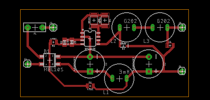
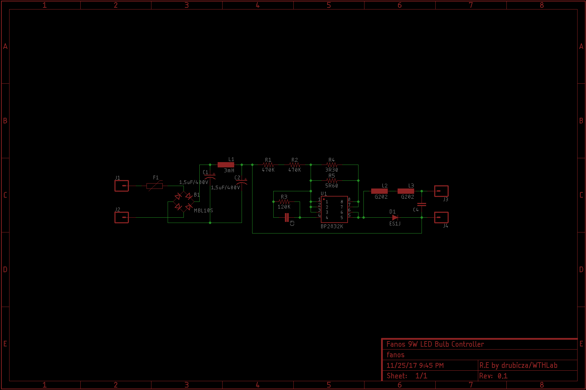

# fanos-re

This is a reverse engineered schematic of fanos 9W LED light bulb controller. Some of the components value were missing and will be added later. The main controller for this board is BP2832K and you may find the BP2832A datasheet in this repository.

